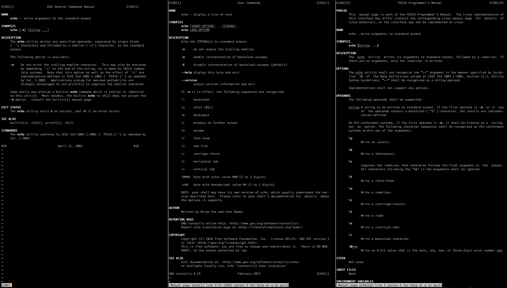

# Getting Help

## Why? and how?

The Unix command line has been around forever, and it's not known for being particularly user-friendly.
But once we invest a little time in learning it well, the command line is a powerful tool that can improve our lives as software developers.

Today's workshop isn't meant to overload you with information.

__I'll be skipping a lot of things__ as we go through these topics, including things that I actually think are pretty important and useful.
I think it can be hard for experienced command line users to resist the tempation to tell new folks *all the things*, but that's what I'm trying to do here.
Prioritization is critical when we're trying to learn new things.

I find that I learn the most when I'm trying things out for myself, and that's the way we're going to work together today.
So I'll show you a few things, but the majority of your learning is going to be hands-on.
The more I'm actively participating by typing, or talking out loud, the less likely my eyes are going to glaze over and forget the stuff I want to be learning.

The way you interact with this first module is going to be the most important, because it sets the stage for everything else.
I recommend typing every single command directly in, and trying out as much as you can in the time allotted to the exercises.


## Where do we start?

Make sure you're using [Bash](https://www.gnu.org/software/bash/).
For our purposes today, the version shouldn't matter.
Day-to-day, I actually use [Zsh](http://zsh.sourceforge.net/), and a lot of folks I know use the [Fish](https://fishshell.com/) shell.
But Bash comes pre-installed with your MacOS, Linux, or Windows Subsystem for Linux (WSL), and it's helpful for us all to be looking at similar things.


## Experimentation mindset


## Let's go for it!

```shell
$ echo hello there
hello there
```

__IMPORTANTLY__: The `$` character isn't something you should copy.
It's called the __prompt__ and it tells you that the shell is ready for your input.
Your prompt might look different, and that's OK.
But all of our examples today will use `$ ` as the prompt.

Notice:

- We're running the `echo` program
- with some arguments (two arbitrary words, `hello` and `there`)
- and seeing the program output exactly *the arguments that it was given*


## How do we see what we can do?

Whenever I'm in a new language or programming environment, one of the first things I want (after installation) is to know how I can get my questions answered quickly.
When I get curious, it's always nice to know that the answers are usually close at hand.


### `man`

One of the best places to start when figuring out how to use a given program is the manual pages, which you can access with the `man` command.

The output here (and for many of the programs we cover today) is going to vary, depending on your operating system.
Try it for yourself, and let's go recursive right away!

```shell
$ man man
```

There are three really important keystrokes to memorize here!

- `q` to quit
- `f` to scroll a page forwards
- `b` to scroll a page backwards

There are plenty of other commands that you might find useful, and you can press `h` to find out what they are.

You don't need to read or understand all of the output from `man`, but you should see some prose that includes some information about usage, arguments, and the various command line options and arguments.

Again: __it's not important to memorize command-line flags__, especially not right now.
But we need to be able to read the manual pages to find out or remember what they are.


## Exercises

- [Getting Help - Exercises](./exercises/01_getting_help_exercises.md)


## Differences between platforms

There are often differences in commands between MacOS, Linux (whether on WSL or not), and other Unix variants.
When you come across a difference, don't panic!

Here are some examples of output that you might see for `man echo`, if you're you're running MacOS, Ubuntu Linux (whether Windows or not), or CentOS Linux (pictured from left to right).
Don't worry about actually trying to read these, just notice that the output is different.
Commands with the same name can and do work slightly differently across operating systems.
So if you write a shell script that works on your Mac, you don't *necessarily* know that it'll work on a Linux production machine without tweaks.
If you find yourself in that situation, you've probably got more experimentation ahead of you!




## Wrap-up

We've learned:

- how to read and enter example Bash commands, ignoring the `$` prefix
- how to get help and learn more about various commands using the manual pages (`man`)

Next, we'll get better at navigating the command line and directory structure.
